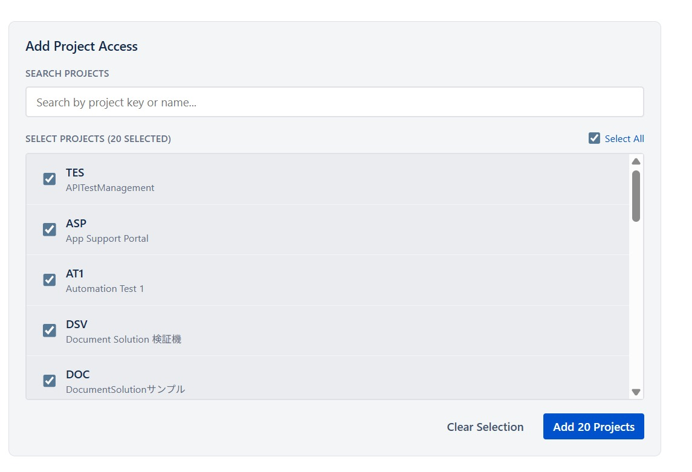
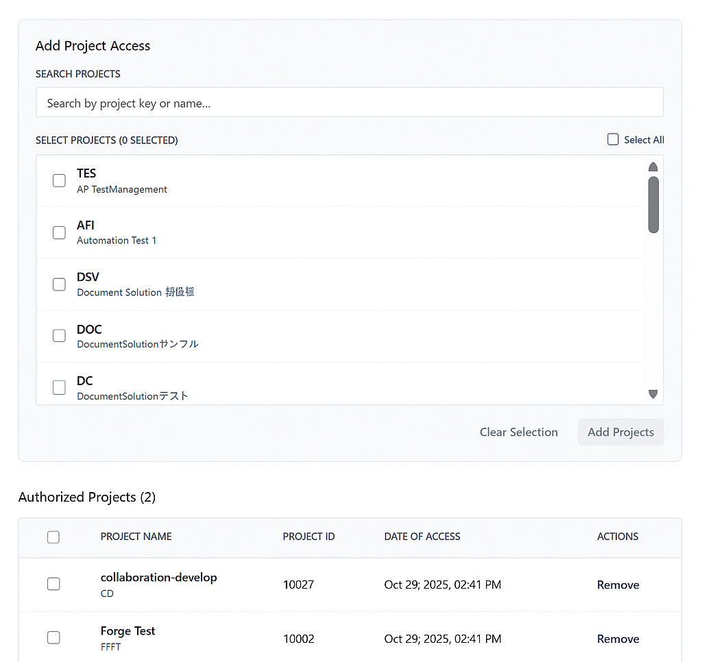
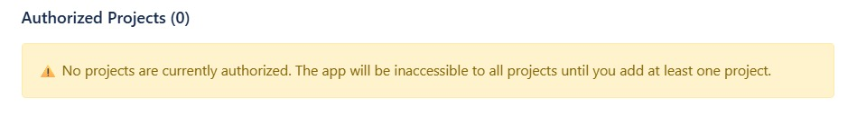
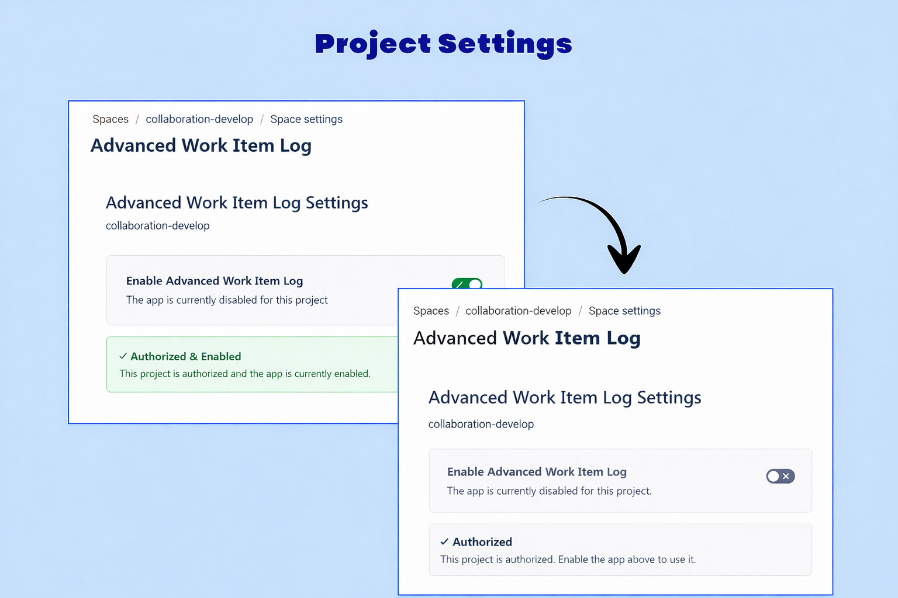
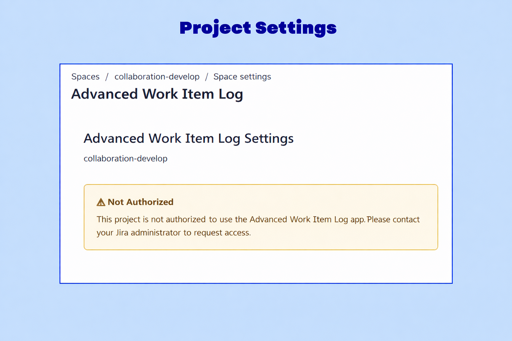
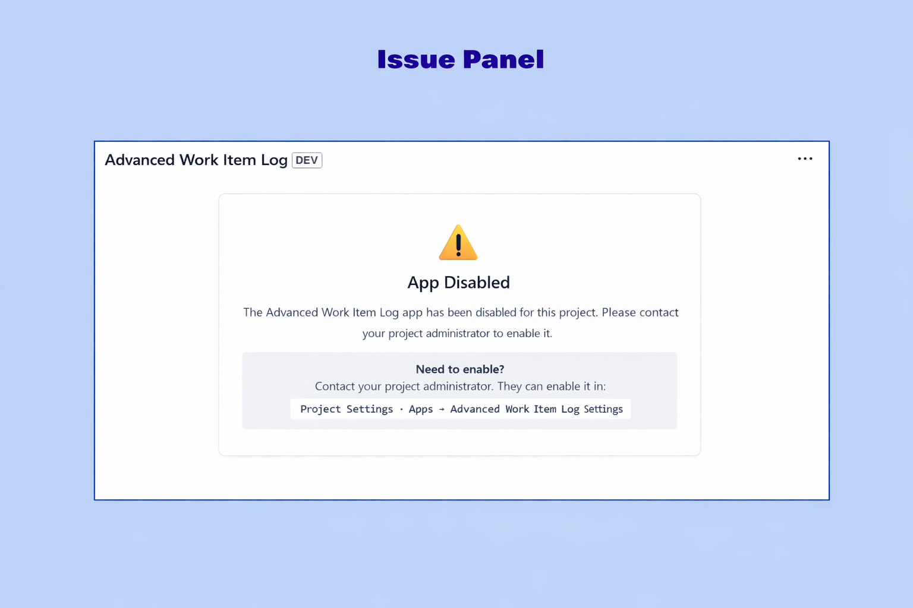
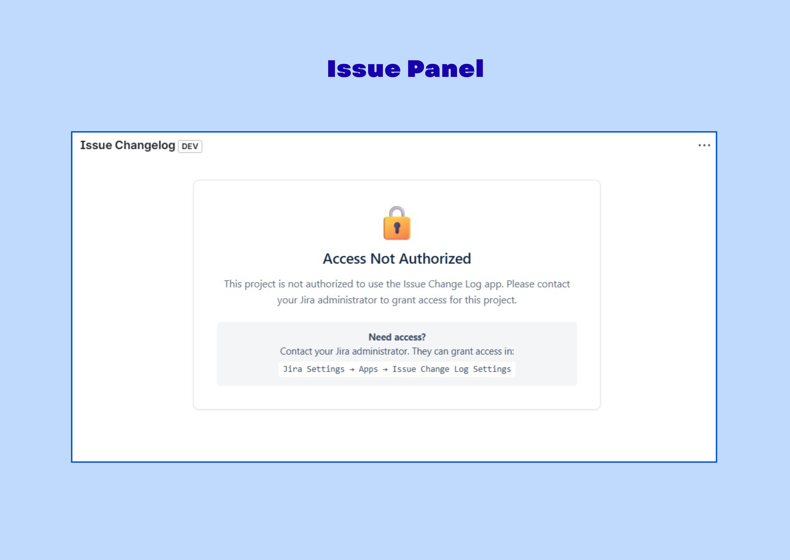
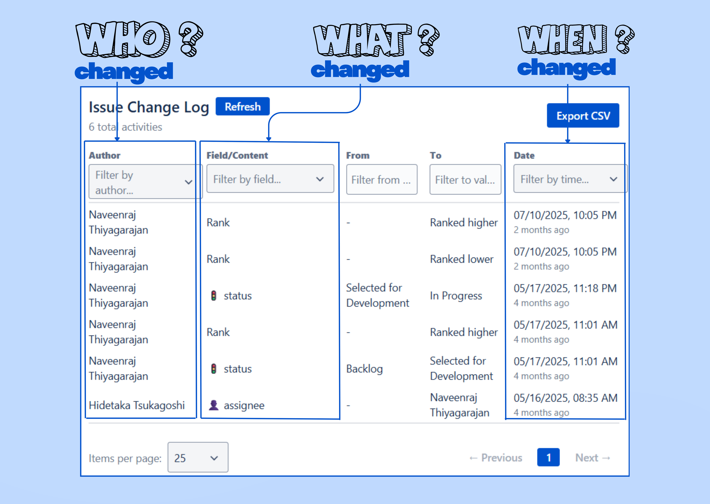
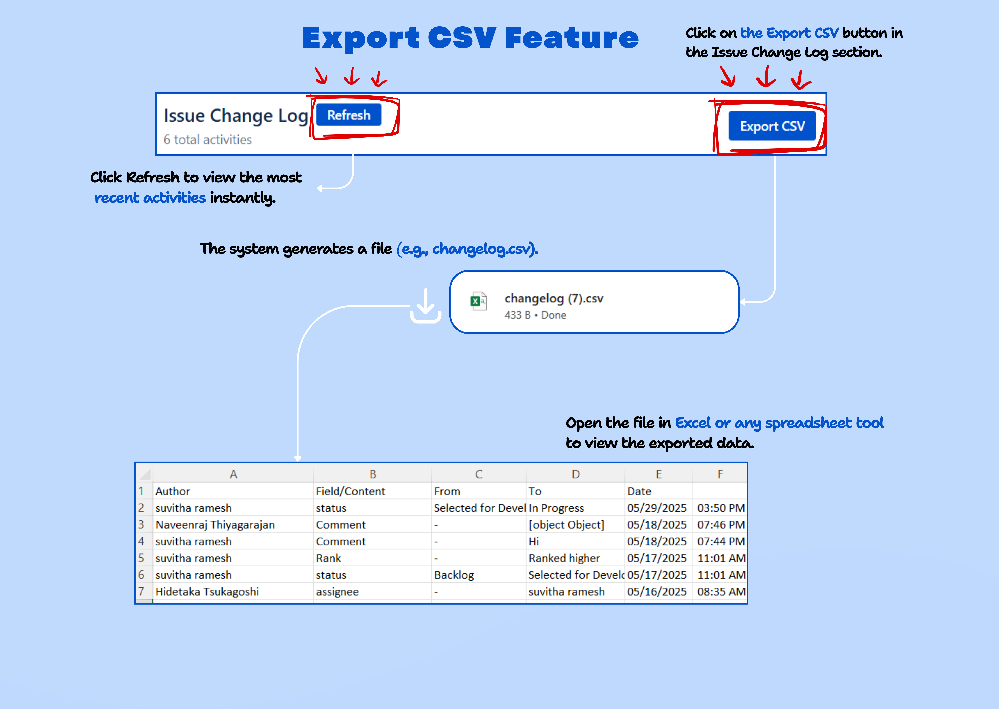
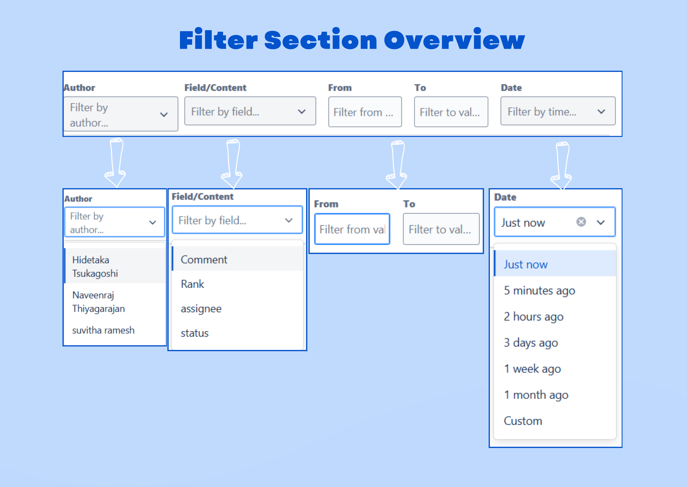

# Configuration & Setup

This page documents site- and project-level configuration for the Issue ChangeLog app. It uses the screenshots and illustrations included in the repository to make setup and troubleshooting easier. The page also shows how the site styles (info-note, info-box, tick lists, etc.) are applied so you get a consistent look and feel.

> Quick contract (what this section delivers)

- Inputs: Jira site admin access, project admin access
- Outputs: site-level authorized projects, per-project enablement
- Error modes: missing admin permissions, storage write failure

---

## At-a-glance flow

1. Site admin authorizes projects (site-level)
2. Project admin enables the app per project (project-level)
3. Users with Jira permissions view changelogs inside issue panels

---

## Illustrations & screenshots

I included all images found in the repository so you have visual references while performing each step. Use them as quick navigation aids.

### Admin console & site-level screenshots


_Figure: Example Jira admin area where apps are managed._


_Figure: "Manage apps" screen showing installed apps._


_Figure: The Issue ChangeLog admin page — use this to authorize projects._




### Project settings screenshots




### Issue panel & feature screenshots




### Feature illustrations






### Branding & homepage


---

## Site-level configuration (Jira administrators)

Use the screenshots above (jira-admin-\*) when following these steps.

1. Go to Jira Settings → Apps → Manage apps.
2. Open the Issue ChangeLog admin page (see `jira-admin-3.png`).
3. In **Add Projects**, select projects you want to authorize.

HTML-styled notice (uses existing site CSS `.info-note`):

<div class="info-note">
  <div class="info-icon">ℹ️</div>
  <div class="info-text"><p>Only site administrators can authorize projects. If no projects are authorized, the app will not be available anywhere (this is by design).</p></div>
</div>

#### Bulk operations

The admin screen supports bulk add/remove (see `jira-admin-4.jpg`, `jira-admin-5.jpg`). Use the "Select all" checkbox to authorize every project in one action.

---

## Project-level configuration (project administrators)

Use `Project-settings-1.png` and `project-settings-2.png` as references.

1. Navigate to Project Settings → Apps → Issue ChangeLog.
2. Toggle the enable/disable switch.

If the project is enabled but not authorized by the site admin, users will see a clear message. The app checks both site authorization and project enablement before showing changelogs.

<div class="info-box">
  <div class="info-icon">🔒</div>
  <div class="info-content"><h3>Note</h3><p>Enabling at project level does not override site-level authorization. Both must be true for users to see change logs.</p></div>
</div>

---

## UX notes: Issue panel behavior

- See `issue-panel-1.png` / `issue-panel-2.png` for how change logs appear inside an issue.
- When disabled or unauthorized, the panel displays a friendly message instead of data.

---

## Storage & configuration shape

The app stores minimal JSON objects in Forge storage. Example shapes (already present in the codebase):

```javascript
// site-level
{
  "allowedProjects": ["KC","PROJ"],
  "allowedProjectsData": { /* per-project metadata */ }
}

// project-level
{
  "project_KC_settings": { "enabled": true, "lastUpdated": "..." }
}
```

---

## Performance tuning (what to change)

- Pagination default: 20 items per page. Use shorter pages for very large projects.
- Time filters: choose a shorter default range for high-activity projects.
- Selective authorization: only authorize projects that need this feature.

Use `feature-1.png`–`feature-4.png` for UI hints on filter/pagination controls.

---

## Troubleshooting common issues (quick fixes)

1. Projects not appearing: check `read:jira-work` permission and project visibility.
2. Can't add projects: ensure you're in a site admin group.
3. Users see access denied: confirm both site authorization and project enablement.

For persistent storage errors, check the Forge app status in Apps → Manage apps.

---

## Style analysis — classes available and how to use them

I scanned `styles.css` and found the CSS utilities we should reuse to keep a consistent UI:

- `.info-note` — large, prominent informational callout (used above for admin notes). Use for site-level important notices.
- `.info-box` — compact info box with a colored left border; good for short warnings/tips.
- `.info-message-box` / `.info-message-content` — for center-aligned, wider callouts.
- `.benefit-card`, `.benefit-card-highlights` — styled cards and highlighted items; use for checklists or recommended settings.
- `.tab-item-benefits` — creates a tick-style bullet list via CSS ::before (uses a blue ✓). Good for 'what to check' lists.
- `.hero-image-card` — wraps images with consistent radius and shadow for large illustrative images.

Example: use a tick list with the existing CSS by writing:

```html
<ul class="tab-item-benefits">
  <li>Ensure the project is authorized at site-level</li>
  <li>Enable the app under Project Settings</li>
  <li>Verify user Jira permissions</li>
</ul>
```

This will render with the styled checkmarks provided by the stylesheet (no extra icons required).

---

## Complete configuration checklist (use the tick-list style)

<ul class="tab-item-benefits">
  <li>Install the app on the Jira instance</li>
  <li>Authorize the required projects (site admin)</li>
  <li>Enable the app in project settings (project admin)</li>
  <li>Confirm users can view issues and changelogs</li>
  <li>Adjust pagination and time filters for large projects</li>
</ul>

---

## All screenshots used (for quick copy-paste)

- `./jira-admin-1.png`
- `./jira-admin-2.png`
- `./jira-admin-3.png`
- `./jira-admin-4.jpg`
- `./jira-admin-5.jpg`
- `./Project-settings-1.png`
- `./project-settings-2.png`
- `./issue-panel-1.png`
- `./issue-panel-2.png`
- `./feature-1.png`
- `./feature-2.png`
- `./feature-3.png`
- `./feature-4.png`
- `./home img.png`
- `./innoov.png`

---

## Next steps I will take

1. Wire any missing images into the site pages if you'd like them embedded elsewhere.
2. Optionally create a short GIF demonstrating enable/disable flows (small add-on).

If you'd like, I can also preview this page locally (run a simple local static server) and confirm the info-note and tick lists render correctly.

---

## Support

For configuration assistance, see [Support and Contact Information](./07-support-contact.md).
